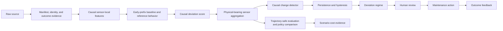

# Condition Monitoring Architecture

This is the active architecture for the condition-monitoring evidence path. Phase M
implemented the causal monitor as Set 1-only evidence, and Phase N killed its policy
claim as not robust beyond the clock. No replacement policy or serving path is
implemented by this document.

## Product Contract

The monitor will identify persistent causal deviation from an early-trajectory
baseline and emit an inspection alert for human review. It does not label a bearing
healthy, failed, or due for automatic replacement.



The manifest/identity/outcome evidence, canonical sensor-local features, and
early-prefix monitor are implemented foundations. Human-review workflow, policy, and
scenario-cost work remain planned and cannot claim a field result.

## Planned Causal Monitor Contract

For each monitored physical trajectory, the Phase M monitor:

1. Fit a robust sensor-local baseline and nearest-neighbor/reference behavior from
   only an early prefix of that trajectory.
2. Score later timestamps causally, without future information or full-trajectory
   normalization.
3. Aggregate the two sensor views at the physical-bearing timestamp using fixed,
   documented weights.
4. Apply a causal change detector and persistence/hysteresis rule.
5. Emit exactly one of these scientific states:
   `baseline-consistent`, `deviation-observed`,
   `persistent-severe-deviation`, or `insufficient-evidence`.

These are deviation regimes. They are not healthy, warning, failure, maintenance,
or RUL truth. Endpoint proximity may be joined only after scoring for retrospective
evaluation; it cannot fit features or thresholds and cannot enter online scoring.

Phase M predeclared a small sensitivity grid for baseline prefix length,
reference-neighbor count, deviation threshold, persistence, and sensor weighting. It
does not tune against a final endpoint proxy or use model selection to search this grid
opportunistically.

## Evaluation and Policy Contract

The primary evidence will be baseline stability, descriptive trendability and
monotonicity, cross-bearing consistency, alert burden, persistence/hysteresis,
lead time to the authorized failure-endpoint proxy for documented failures, abstention,
and sensitivity. Alert burden is not
a false-positive rate without defensible state truth. Lead time is not failure lead
time. Accuracy, AUC, and F1 are not claims without supported labels.

The planned policy comparison, if separately reauthorized after a new evidence path,
would compare five policies:

1. Run to failure.
2. Fixed-interval replacement.
3. Elapsed-time-only policy.
4. Endpoint-proxy supervised benchmark.
5. Signal-based condition monitor.

Phase N ran the prerequisite frozen clock-comparator proof instead. Its
`KILL_SIGNAL_POLICY_NOT_ROBUST_BEYOND_CLOCK` result blocks policy and scenario-cost
implementation from the current monitor evidence: sensitivity ordering was not stable
and per-variant alert-onset ordering was not available in the frozen evidence.

The scenario calculation must keep each client-supplied input visible:

```text
total cost = unplanned failures * failure/downtime cost
           + planned replacements * replacement cost
           + premature-life loss cost
           + inspections * inspection cost
```

Required inputs are failure/downtime cost, planned replacement cost, inspection
cost, intervention lead time, lost remaining-life cost, and operating
horizon/population. The decision ladder is `monitor -> inspect -> schedule
maintenance -> urgent action`. Until prospective client evidence exists, results are
ranges and sensitivities, not guaranteed savings, production effectiveness, exact
failure timing, or automatic-replacement readiness.

## Data and Evidence Boundary

Set 1 is development evidence. The `observed_failure_endpoint_proxy` convention
applies only where the official manual identifies terminal damage and remains a
secondary retrospective benchmark. Set 2 has a frozen role under Phase I and no
supervised target under Phases J and K; this architecture authorizes neither use nor
target creation. The observed candidate remains protected until source/identity
resolution. No external-generalization claim is supported today.
